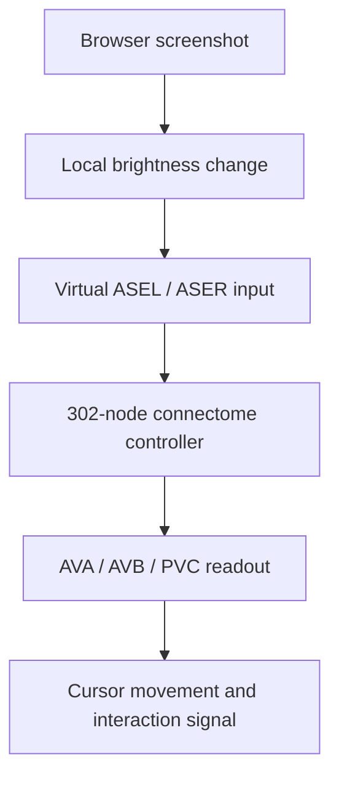

# TheWorm

> **Work in progress.** The connectome tools and early neural-controller prototype are working. The browser/launch integration is still being developed, and **no TheWorm token has been launched**.

TheWorm is an experiment in giving a computer interface to the 302-neuron nervous system of the adult hermaphrodite *Caenorhabditis elegans*.

The project currently loads published anatomical connectivity, explores paths from sensory neurons into locomotion-related interneurons, runs a small OpenWorm c302 dynamics experiment, and uses a separate 302-node prototype controller to move a browser cursor. The long-term goal is to let that controller perform a clearly defined interaction on the Pons launchpad on Robinhood Chain.

The planned token is **The Worm** (`TheWorm`), paired with **PFE**. That pairing is configured in the code, but it has not been launched.

## Current status

| Milestone | Status |
|---|---|
| Load the Cook et al. 2019 hermaphrodite connectome | Working — 302 neurons found |
| Inspect incoming and outgoing connections for a named neuron | Working |
| Trace anatomical paths from ASEL toward AVA, AVB, and PVC | Working |
| Generate chemical- and electrical-connection matrices | Working |
| Run a 16-cell c302 C1 ASEL/ASER stimulation experiment | Working; output traces are committed |
| Run a custom 302-node continuous-activity controller | Prototype implemented; not biologically validated |
| Map the controller to cursor movement in Chromium | Prototype integrated |
| Run the Cook 2019 graph as a fixed language-model reservoir | Working; 302-node graph and causal controls tested |
| Train and evaluate a Worm Language Model adapter | **Not done**; there is no working WLM chat yet |
| Run the launch flow safely in dry-run mode | In development |
| Launch TheWorm | **Not done** |

## How the current prototype works



This is a virtual interface mapping. *C. elegans* does not see a webpage. In `worm_eye.py`, the average brightness around the cursor stands in for a changing environmental signal:

- increasing brightness stimulates ASEL;
- decreasing brightness stimulates ASER;
- AVB and PVC activity contribute to forward movement;
- AVA activity contributes to reverse movement;
- left/right AVB asymmetry contributes to steering;
- a change in AVA activity currently provides the artificial interaction signal.

The browser adapter identifies relevant form elements. When the controller reaches and activates a field, the rig types the predetermined text. The rig also handles wallet connection, terms acceptance, the token image, any unfinished fields, paired-asset selection, creator-tax configuration, transaction signing, and confirmation. Those are not decisions made by the worm model.

## Three layers that must not be confused

| Layer | What is real | What is modeled or chosen |
|---|---|---|
| Cook 2019 connectome tools | Neuron names, connection partners, connection weights, chemical-synapse records, and gap-junction records | Which neurons and paths we inspect |
| `asel_simulation.py` | A c302/NeuroML circuit containing named *C. elegans* neurons | The 16-cell subset, 5 pA ASEL/ASER stimulus, timing, and C1 parameters |
| `worm_sim.py` browser controller | Its 302-node topology and connection weights come from the connectome graph | Continuous `tanh` dynamics, scale factors, chemical signs, sensory encoding, and motor/click decoding |

The c302 experiment is **not** currently the browser controller. The browser uses the faster custom model in `worm_sim.py`.

Chemical connections in the custom controller are assigned deterministic random positive or negative signs because the Cook connection matrix alone does not provide every functional sign needed by this simplified model. Therefore, this should be described as a **connectome-based controller prototype**, not a complete biological simulation of the worm.

The interface currently labels above-threshold continuous activity as “neurons firing.” The model does not produce experimentally measured spike events; that label will be changed to “active neurons.”

## Side project: Worm Language Model

The repository now includes the first verified component of a **Worm Language Model (WLM)** experiment: the 302-neuron Cook 2019 connectome running as a fixed recurrent reservoir. It supports an intact graph, a no-edges control, a shuffled-connectome control, deterministic reset, and causal sequence tests.

The connectome is **not a standalone language model**. The proposed architecture uses a frozen conventional language model for tokenization and language representations, sends those representations through the fixed worm reservoir, and trains a small bounded adapter to adjust the model's next-token scores. Only that adapter would be trained.

The website's WLM page is therefore a build-status preview, not a simulated chat. It will remain disabled until a real adapter has been trained and compared with controls that can show whether the worm wiring contributes anything beyond an ordinary projection.

- [Read the WLM design, controls, and run instructions](worm_language_model/README.md)
- [Open the website preview](site/web/wlm.html)

## Why Alzheimer’s and PFE?

The Alzheimer’s/PFE direction has a specific historical connection. In 2004, researchers affiliated with Pfizer Central Research published **“Screening for Presenilin Inhibitors Using the Free-Living Nematode, Caenorhabditis elegans.”** The study used worm presenilin biology to develop a mechanism-based screening assay relevant to Alzheimer’s drug discovery.

- [Read the Pfizer-affiliated paper on PubMed](https://pubmed.ncbi.nlm.nih.gov/15006138/)

That is the reason PFE is the planned paired asset. It does **not** mean that Pfizer sponsors or endorses this project, that this project models Alzheimer’s disease, or that an approved Pfizer treatment resulted from this worm assay.

## What is in the repository

| File | Purpose |
|---|---|
| `worm_connectome.py` | Loads the Cook 2019 hermaphrodite dataset and checks for all 302 neurons |
| `inspect_neuron.py` | Lists the strongest incoming and outgoing connections for a named neuron |
| `trace_path.py` | Finds shortest-hop anatomical paths through chemical synapses and gap junctions |
| `build_graph.py` | Converts the connectome into NumPy chemical and electrical matrices |
| `build_positions.py` | Extracts neuron coordinates from c302’s bundled NeuroML cell files |
| `asel_simulation.py` | Generates and runs the 16-cell c302 C1 stimulation experiment |
| `worm_sim.py` | Implements the custom 302-node continuous-activity model |
| `worm_eye.py` | Encodes local brightness change and decodes locomotion-related activity |
| `rhlive.py` | Connects the worm controller, local dashboard, Chromium, wallet adapter, and Pons launch flow |
| `web/live.html` | Local live dashboard for the worm and browser |
| `rhprovider.py`, `rhwallet.py`, `rhdryrun.py` | Robinhood Chain wallet/provider and non-broadcast testing infrastructure |

Some fruit-fly files, comments, interface labels, and `FLY_*` environment-variable names remain from the upstream FlyCoin Robinhood project. They are legacy infrastructure, not evidence that the current controller is still a fly. Removing and renaming them is part of the cleanup roadmap.

## Quick start: inspect the connectome

These instructions are written for a GitHub Codespace or another Linux/macOS terminal.

```bash
git clone https://github.com/shawkkkkk/theworm.git
cd theworm

python3 -m venv .venv
source .venv/bin/activate

pip install -r requirements.txt
```

Verify the dataset and explore it:

```bash
python worm_connectome.py
python inspect_neuron.py ASEL
python trace_path.py ASEL
```

Build the matrices used by the custom controller:

```bash
python build_graph.py
```

`build/graph.npz` is generated locally and intentionally excluded from Git.

## Optional: run the c302 experiment

The c302 framework is installed separately so that its source is not copied into this repository:

```bash
cd /workspaces
git clone https://github.com/openworm/c302.git c302-openworm
pip install ./c302-openworm
pip install neuron

cd /workspaces/theworm
python asel_simulation.py
```

The simulation runs headlessly and writes voltage/activity traces, including:

```text
c302_C1_ASEL.dat
c302_C1_ASEL.activity.dat
examples/LEMS_c302_C1_ASEL.xml
examples/c302_C1_ASEL.net.nml
```

This is a controlled stimulation experiment, not yet a chemical-gradient model and not a full 302-neuron c302 run.

## Optional: open the dry-run browser prototype

Do not fund a wallet for development. Keep live broadcasting disabled.

```bash
python -m playwright install chromium
python build_graph.py
python build_positions.py
python rhwallet.py new
```

The wallet command creates a local `.env` file. It is excluded by `.gitignore`. Never paste that file, its private key, or a seed phrase into GitHub, an issue, a screenshot, or a chat.

For a non-broadcast browser run, keep these settings in `.env`:

```dotenv
FLY_ALLOW_BROWSER=1
FLY_RH_LIVE=0
FLY_RH_PAIR=PFE
```

Then run:

```bash
python rhlive.py
```

Open port `4651` from the Codespaces port panel. With `FLY_RH_LIVE=0`, the rig must stop before signing or broadcasting a launch transaction.

## Safety boundaries

- Live mode is off by default: `FLY_RH_LIVE=0`.
- Browser control is separately disarmed by default: `FLY_ALLOW_BROWSER=0`.
- Private keys belong only in the gitignored `.env` file.
- `rhdryrun.py` is intended to exercise signing logic without broadcasting.
- A human must make the decision to enable any funded or live action.
- The project will use dry runs and test environments before any proposed mainnet interaction.

## Roadmap

1. Remove the remaining fly-specific code and rename the legacy environment variables.
2. Make the c302 experiment’s connectome reader explicit and validate its generated connections against Cook 2019.
3. Replace random chemical signs with evidence-based neurotransmitter/receptor annotations where available.
4. Replace brightness change with a documented, time-dependent virtual chemical-gradient encoder.
5. Replace the temporary AVA interaction signal with a better-justified feeding/pumping interface mapping.
6. Add tests for graph construction, neural dynamics, sensory encoding, and safety gates.
7. Demonstrate the complete workflow on a local fake launch page.
8. Run an auditable Robinhood Chain dry run/test environment.
9. Consider one human-approved live launch only after every earlier milestone is reproducible.
10. Train and evaluate the WLM adapter against no-edges, shuffled-connectome, and direct-input baselines before enabling its chat interface.

## Sources and acknowledgements

- Cook SJ et al. (2019), [“Whole-animal connectomes of both *Caenorhabditis elegans* sexes”](https://pubmed.ncbi.nlm.nih.gov/31270481/), *Nature* 571:63–71.
- OpenWorm’s [C. elegans Connectome Toolbox](https://github.com/openworm/ConnectomeToolbox), used through `cect` and `Cook2019HermReader`.
- OpenWorm’s [c302 framework](https://github.com/openworm/c302), used for the NeuroML dynamics experiment and neuron-coordinate extraction.
- Alex Wormuth's [Fly Language Model](https://github.com/nftechie/flm), whose frozen-language-model, fixed-connectome-reservoir, and trained-readout structure inspired the WLM side experiment. Its MIT notice is reproduced in `worm_language_model/THIRD_PARTY_NOTICES.md`.
- The browser, wallet, and Robinhood Chain foundation began from [fruitflydev/flycoinrh](https://github.com/fruitflydev/flycoinrh). Its MIT attribution remains in `LICENSE` and `NOTICE`.
- Robinhood Chain network details are documented by [Robinhood Chain](https://docs.robinhood.com/chain/deploy-smart-contracts/).

## Independence and risk disclosure

TheWorm is an independent educational, scientific-computing, and digital-art experiment. It is not affiliated with or endorsed by Pfizer, OpenWorm, the Cook et al. authors, Robinhood, Pons, or the upstream FlyCoin developers.

Nothing in this repository is medical or financial advice. A token, if ever created, would be experimental and highly risky. Do not interpret the project’s choice of PFE as a statement about Pfizer’s stock, products, or expected performance.

## License

The code is distributed under the MIT License in `LICENSE`. Third-party datasets, models, trademarks, and services remain subject to their own licenses and terms.
